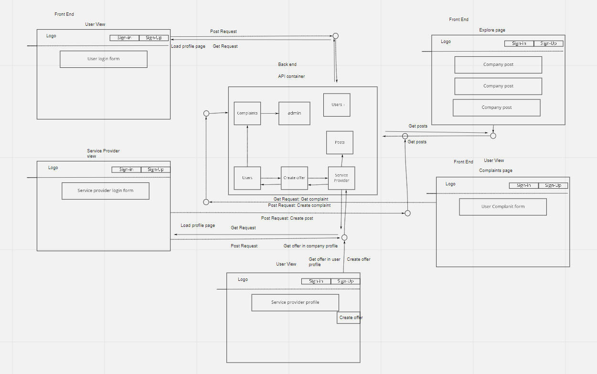

# connect
## Team members
1-Adham Mhaydat
2-Ashrf Obeidat
3-Ahmad Alrasheed
4-Aseel Al-Saqer

## Project Description

Connect is a web application to connect any service provider in the world with any one seeking for service, It provides 
very easy way for companies to propose their work and services to the users,also the users can be connected to any company
they want to get service from, we will guarantee the user's rights by forcing any service provider to upload his commercial record image and his identity card so that we can save the user rights in case that the service provider was a mock company.

MVP : 

* We expect the user to find all proposed services from all registered companies only by entering `Explore` page.

* We expect the user to find companies and services online just by clicking on `Connect` button in the companies profile.

* we expect that any company can post about the service that it is providing, so that the user can see it.

* We expect that if a user want's a specific service he/she can create offer from the wanted company profile with the service the user want's

* We expect the user to see his activity on his profile page

* We expect that the user can provide his opinion by adding a review to a specific company after he takes any service from it.

* We expect that the user rights will be perfectly guaranteed, because if the service was not provided by the company the user will be able to raise a complaint to us, so that we will contact the company and investigate about the user complaint.

Future Goal:

* Build Chatting tool to allow the user to communicate with the company on our web application.
* Build a secure tool to allow money transferring in an out of our web application
* Build a tool for video chatting only for job seekers.

# Getting Started:

Clone this repository to your local machine. [https://github.com/Pythonaholic-Team/connect]()

Then type `poetry install` to install all of the dependencies needed.

Load up the project using your favorite IDE.

# User Stories

The stories of Connect are managed in a project managment system called trello.

**Link for Project managment system** : [Link](https://trello.com/b/3Xk9LJrl/pythonaholic)

# Software Requirements

The Software requirements are mentioned with vision , scope , MVP and functional and non-functional requirements.

**Link for Software Requirements** : [Link](requirements.md)

# Domain Modeling

**The Model of domain defined as module based system as the following :**

# WireFrames

**Link for project wireframes** : [Link](wireframes.md)

# References
* [W3school](https://www.w3schools.com/)
* [MDN](https://developer.mozilla.org/en-US/)
* [StackOverFlow](https://stackoverflow.com/)
* [Nextjs](https://nextjs.org/docs/getting-started)
* [Django](https://docs.djangoproject.com/en/4.0/)
* [Tailwind](https://tailwindui.com/documentation)

# Technologies Used:
* Python
* Visual Studio Code 
* Trello
* Nextjs
* Django 
* Tailwindcss
# Change log:

Version 0.1.0 : initial project version
